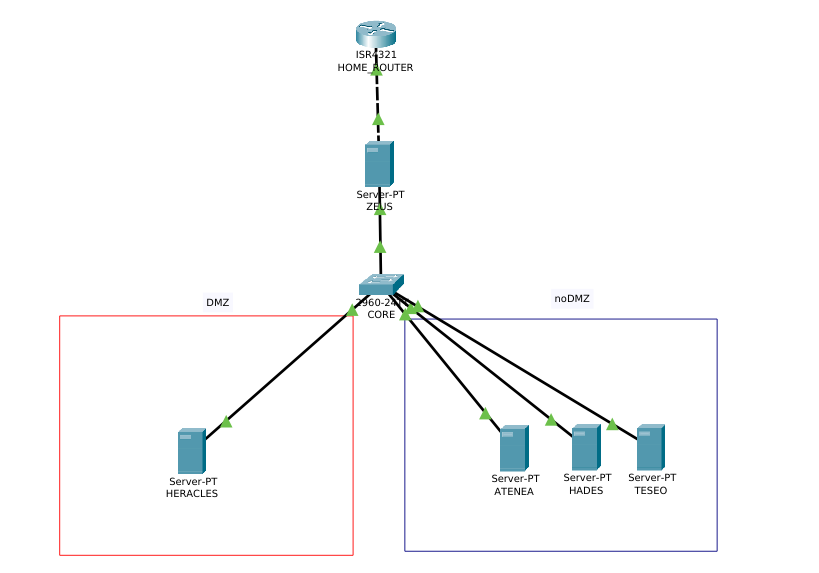

# Elaboración de un SOC Doméstico (Homelab)
Proyecto final de Administración de Sistemas Informáticos en Red

**Índice**

1. [Introducción](#introducción)
2. [Objetivos](#objetivos)
3. [Descripción del proyecto](#descripción-del-proyecto)
4. [Hardware empleado](#hardware-empleado)
   1. [Equipo anfitrión](#equipo-anfitrión)
   2. [Router](#router)
   3. [Otros elementos](#otros-elementos)
5. [Aplicaciones utilizadas](#aplicaciones-utilizadas)
   1. [Sistemas Operativos](#sistemas-operativos)
   2. [Aplicaciones](#aplicaciones)
6. [Diseño de red](#diseño-de-red)
   1. [Topología](#topología)
   2. [Planteamiento de subredes](#planteamiento-de-subredes)
   3. [Tabla de direccionamiento](#tabla-de-direccionamiento)
   4. [Ficheros de configuración (EN DESARROLLO)](#ficheros-de-configuración)
7. [Despliegue del homelab](#despliegue-del-homelab)
   1. [Configuración de hardware de las máquinas virtuales](#configuración-de-hardware-de-las-máquinas-virtuales)
8. [Escenarios (EN DESARROLLO)](#escenarios)
9. [Licencia (EN DESARROLLO)](#licencia)

---

# Introducción

¡Buenas! Soy Manuel Jesús Flores y soy estudiante de Administración de Sistemas Informáticos en Red.

Este repositorio contiene el proyecto integrado de dicho módulo y trata acerca de un homelab enfocado a seguridad, es decir, montar un centro de operaciones de seguridad en miniatura.

A lo largo del repositorio puedes encontrar los avances realizados y por donde va. Se admiten mejoras a través de los *issues* o *pull requests* pero seguramente se implemente una vez finalizado el proyecto. Para cualquier duda no dudes en abrirme un *issue* y te respondo en cuando pueda, ¡nos vemos!

# Objetivos
Es imposible negar que la seguridad se está convirtiendo a pasos cada vez mayores en un punto a reforzar tanto de empresas como de administraciones públicas pues, como se ha ido desarrollando a lo largo de la crisis mundial originada por el CoVid-19, varios hospitales extranjeros han sido infectados mediante un ransomware.

Este ataque se podía haber evitado o haber disminuido su gravedad si se contaran con expertos en seguridad informática y por ello, el objetivo principal de este proyecto es el crear un entorno desde cero de aprendizaje o de simulación de un centro de operaciones de seguridad (SOC) para poder adquirir habilidades tanto en seguridad como configuración de redes así como proporcionar un entorno seguro donde ejecutar malware conocido y saber que vulnerabilidades aprovecha para realizar su posterior explotación.

Para lograr este objetivo global se necesitan desarrollar y alcanzar objetivos individuales que se entrelazan entre sí. Los objetivos individuales o específicos del siguiente proyecto son:

* Configurar una red interna virtual donde incluir equipos clientes, servidores y dispositivos IoT.

* Entender los logs ofrecidos por aplicaciones acerca del tráfico generado por todos los dispositivos de la red.

* Desplegar un sistema que garantice la alta disponibilidad mediante aplicaciones de terceros con las que se pueda analizar el tráfico, el rendimiento y adaptar el funcionamiento del sistema según los valores devueltos.

* Conocer los diferentes factores de amenaza, saber analizarlos, enfrentarlos y adoptar medidas para evitar posibles nuevos ataques.

* Analizar las aplicaciones especializadas en el mercado e intentar, en la mayor medida posible, usar aplicaciones de software libre.

Finalmente, como objetivos opcionales se plantean los siguientes:

* Desarrollar un bot en Telegram que sea capaz de analizar los ficheros log del sistema y notificar al administrador del sistema.

# Descripción del proyecto

El proyecto “Elaboración de un SOC Doméstico” nace con la finalidad de, como se indicaba anteriormente, dar una solución de aprendizaje práctico a cualquier persona en el ámbito de la ciberseguridad sin necesidad de invertir una gran cantidad de capital en material (routers, switches, cableado, SAIs…) ya que se trabajará todo a través de la virtualización y, en la medida de lo posible, empleando aplicaciones de software libre aunque es cierto que en muchas empresas se aplican soluciones de software privativo que, en caso de ser necesarias, se usarán promociones de las empresas desarrolladoras que tienen para estudiantes del sector (principalmente el programa Github Students).

Las tecnologías que se van a usar, nombrando por encima, serán como sistemas operativos Ubuntu Server y Desktop, Metasploitable, Kali Linux y Windows Server 2019. Si hablamos de nivel de aplicación se va a usar PfSense, Metasploit Framework, Ettercap o Wireshark entre otros y, a nivel de metodología, se empleará una metodología que conocemos como Red&Blue Team. Esta metodología está en alza y la forman titulados en el campo de seguridad informática que tratarán de atacar (Red team) y defender (Blue team) el sistema de la empresa. Lo interesante de esta metodología es que, aplicándolo en un entorno real, un auditor es capaz de aprender desde ambos puntos de vista y, por tanto, poder proponer y ejecutar soluciones a medida al sistema administrado en cuestión.

# Hardware empleado

El proyecto se va a realizar entero en máquinas virtuales por lo que se necesitará dos equipos principales para el desarrollo de este proyecto. Dichos equipos son:

## Equipo anfitrión

El equipo anfitrión es un portátil MSI GP73 Leopard de 17,3''. Las características técnicas son:

* Procesador Intel Core i7-8750H
* Tarjeta gráfica NVIDIA GeForce GTX1060 6GB
* Un disco duro HDD de 1TB y un disco duro SSD de 256GB
* Conexión WLAN de 2.4GHz y 5GHz, BlueTooth y un puerto LAN de 1GB/s

El enlace del portátil es el siguiente (https://es.msi.com/Laptop/GP73-Leopard-8RD)

## Router

El router usado es un router LiveBox+ suministrado por Orange. El modelo exacto es Arcadyan R02. Las características técnicas son:

* Modo de operación FTTH (a través de puerto Gigabit Ehternet WAN)
* 3 puertos RJ45 Gigabit Ethernet
* 2 puertos RJ11 para telefonía
* 1 puerto USB 2.0 tipo A
* Wi-Fi de Doble Banda 11ac y 11n

## Otros elementos

A parte de estos dos elementos principales contamos con los siguientes elementos complementarios que mejoran el desarrollo del proyecto:

*AVISO: Estos elementos no son necesarios para el funcionamiento del proyecto.*

* Pantalla AOC de 32''
* Pantalla ASUS de 20''
* SmartTV Hitachi
* Repetidor TP-Link Range Extender RE300
* Telefono móvil Huawei P Smart 2019

# Aplicaciones utilizadas

Las aplicaciones utilizadas se van a dividir en dos categorías que son las propias aplicaciones y los sistemas operativos empleados.

## Sistemas Operativos

* Microsoft Windows 10 versión Home de 64 bits.

  * Este sistema será el usado en el equipo anfitrión para la virtualización.
  * URL: https://www.microsoft.com/es-es/windows
* Ubuntu Server 18.04.4. LTS.

  * Este sistema será el principal que contendrá todos los servidores a excepción de **HADES**, **TESEO** y **ZEUS**. No contiene interfaz gráfica.
  * URL: https://ubuntu.com/download/server
* Kali Linux 2020.1b.

  * Este sistema operativo se compone de una suite de herramientas para realizar labores de pentesting y auditorías de red&blue team.
  * URL: https://www.kali.org/downloads/
* Metasploitable 2.0.

  * Este sistema operativo desarrollado por Rapid7 y basado en Linux está diseñado para que sea lo más vulnerable posible y poder entrenar a cualquier usuario en las técnicas de seguridad informática. Se aplicará en el servidor **HADES**.
  * URL: https://metasploit.help.rapid7.com/docs/metasploitable-2
* Clonezilla Server

  * Este sistema operativo basado en Linux está diseñado para gestionar las copias de seguridad de un sistema. Permite hacer la copia vía FTP, SSH o HTTP entre otros, tanto en medios locales como remotos. Se aplicará en el servidor **TESEO**.
* URL: https://clonezilla.org/clonezilla-SE/#clonezilla-se
* pfSense
  * Este sistema operativo es una distribución basada en FreeBSD para ser usado como firewall y router. Se controla a través de una interfaz web. Se aplicará en el servidor **ZEUS**.
  * URL: https://www.pfsense.org/

## Aplicaciones

Las aplicaciones que vamos a usar son:

* Visual Studio Code
  * Entorno de programación desarrollado por Microsoft.
  * URL: https://code.visualstudio.com/
* VMware Workstation 15
  * Entorno de virtualización en el que ejecutaremos las máquinas virtuales.
  * URL: https://www.vmware.com/es/products/workstation-pro.html
* Packet Tracert
  * Simulador de redes de Cisco Systems
  * URL: https://www.netacad.com/es/courses/packet-tracer
* nmap y zenmap
  * Escáner de red y puertos. Viene por defecto en Kali Linux. NMAP corresponde a la aplicación en sí y ZENMAP corresponde a la interfaz gráfica.
  * URL: https://nmap.org
* Wireshark
  * Sniffer de red para capturar y analizar el tráfico. Viene por defecto en Kali Linux.
  * URL: https://www.wireshark.org
* Metasploit Framework
  * Framework desarrollado por Rapid7 que permite detectar vulnerabilidades y explotarlas. Viene por defecto en Kali Linux.
  * URL: https://www.metasploit.com

# Diseño de red

## Topología

La topología de la red será jerárquica, es decir, tendremos un router principal (**HOME_ROUTER**) el cual se conectará al servidor de seguridad (**ZEUS**) que se encargará de filtrar los paquetes e implementar un servidor proxy.  **ZEUS** tendrá otra interfaz que se conectará a un switch (**CORE**) que dividirá entre DMZ (que se encontrará el servidor de acceso público (**HERACLES**) con servicios WEB y FTP) y la noDMZ que será donde se encuentren los hosts y dos tipos de servidores que son:

* Servidores de uso normal
  * Son servidores que se usan normalmente dentro de una empresa y que se encargan de albergar bases de datos, proporcionar un servicio de correo interno, un servicio de DNS interno y un servidor de copias de seguridad. Estos servidores son:
    * **ATENEA**: Servicios de correo interno, DNS interno y base de datos.
    * **TESEO**: Servicio de copias de seguridad.
* Servidor de aprendizaje de seguridad
  * Es un servidor crítico ya que contiene un sistema operativo (*metasploitable*) el cual cuenta con numerosas vulnerabilidades. Este servidor será **HADES**.

Por tanto, la topología final que se presenta es la siguiente:

## Planteamiento de subredes

La red principal será la **192.168.1.0/24**.

Se van a definir seis subredes que son:
* **NoDMZ – USUARIOS**: Esta subred irá orientada para todos los usuarios de la vivienda/oficina. Se necesitará al menos capacidad para 100 dispositivos entre los que tendremos teléfonos móviles, puntos de acceso, invitados de confianza…
* **NoDMZ – SEGURIDAD**: Esta subred irá orientada a mantener un entorno de aprendizaje. Se permitirá un total de 6 dispositivos (servidor HADES y 5 dispositivos más para realizar prácticas). 
* **NoDMZ – SERVIDORES**: Esta subred irá orientada para mantener los dos servidores de servicios internos de la red que son ATENEA y TESEO.
* **DMZ**: Esta subred será exclusivamente para dispositivos que queramos que se puedan acceder desde el exterior (páginas web). Se permiten hasta 14 dispositivos por si fuera necesario agregar nuevos servidores o se quisieran virtualizar y adjudicar una dirección IP propia.
* **CORE**: Esta subred de dos dispositivos estará formada por el servidor de seguridad ZEUS y el switch CORE que son los que distribuyen la conexión principal a las subredes.
* **ACCESO**: Esta subred de dos dispositivos estará formada por el router y el servidor ZEUS para el control de paquetes y seguridad de la red. Será el punto fronterizo de toda la topología.

Dada la topología anteriormente descrita se deberán crear las siguientes subredes:

| Nombre             | Equipos | Red              | Broadcast     |
| ------------------ | ------- | ---------------- | ------------- |
| noDMZ - USUARIOS   | 126     | 192.168.1.0/25   | 192.168.1.127 |
| DMZ                | 14      | 192.168.1.128/28 | 192.168.1.143 |
| noDMZ - SEGURIDAD  | 6       | 192.168.1.144/29 | 192.168.1.151 |
| ACCESO             | 2       | 192.168.1.152/30 | 192.168.1.155 |
| CORE               | 2       | 192.168.1.156/30 | 192.168.1.159 |
| noDMZ - SERVIDORES | 2       | 192.168.1.160/30 | 192.168.1.163 |

Además se deja un remante de 91 direcciones IP cuyo rango comprende desde la **192.168.1.164/24** a **192.168.1.255/24**.

   ## Tabla de direccionamiento
|   Device    |  Port  |  IP Address   | Mask |    Gateway    |
| :---------: | :----: | :-----------: | :--: | :-----------: |
|    ZEUS     |   G0   | DHCP |  --  | -- |
|             |   G1   | 192.168.1.157 |  30  | 192.168.1.153 |
|    CORE     | VLAN1  | 192.168.1.158 |  30  | 192.168.1.153 |
|  HERACLES   |  NIC   | 192.168.1.129 |  28  | 192.168.1.153 |
|   ATENEA    |  NIC   | 192.168.1.161 |  30  | 192.168.1.153 |
|    HADES    |  NIC   | 192.168.1.145 |  29  | 192.168.1.153 |
|    TESEO    |  NIC   | 192.168.1.162 |  30  | 192.168.1.153 |

   ## Ficheros de configuración

   Los ficheros de configuración se encuentran en [ficheros_cisco](./ficheros_cisco)

# Despliegue del homelab

## Configuración de hardware de las máquinas virtuales

La configuración de hardware que va a tener cada una de las máquinas virtuales o servidores será la siguiente:

| Server / VM | Memoria RAM (GB) | Disco Duro 1 (GB) | Disco Duro 2 (GB) | Interfaces de red |
| :---------: | :--------------: | :---------------: | :---------------: | :---------------: |
|    ZEUS     |        4         |        20         |         -         |         2         |
|   ATENEA    |        2         |        10         |         -         |         1         |
|  HERACLES   |        2         |        10         |         -         |         1         |
|    TESEO    |        2         |        10         |        40         |         1         |
|    HADES    |        2         |        10         |         -         |         1         |

Todos los sistemas tendrán por defecto 10GB de disco duro ya que es el mínimo requerido para funcionar. Los servicios que se instalarán no ocuparán mucho espacio ya que todos los sistemas no tienen interfaz gráfica.

Hay algunos casos excepcionales que son:

* **ZEUS**: Este servidor tendrá el sistema operativo pfSense que se puede mejorar con módulos por lo que se dará el doble de espacio para tener capacidad suficiente para guardar dichos módulos.
* **TESEO**: Este servidor tendrá el sistema operativo Clonezilla Server y se encargará de realizar las copias de seguridad de todo el sistema. Por ello, se añade un disco duro de 40GB para almacenar en ese las copias de seguridad que se vayan realizando.

Si hablamos de memoria RAM, todos tendrán 2GB de RAM excepto **ZEUS** que tendrá el doble ya que deberá soportar una carga mayor que el resto de servidores al realizar funciones de firewall y detección de intrusos.